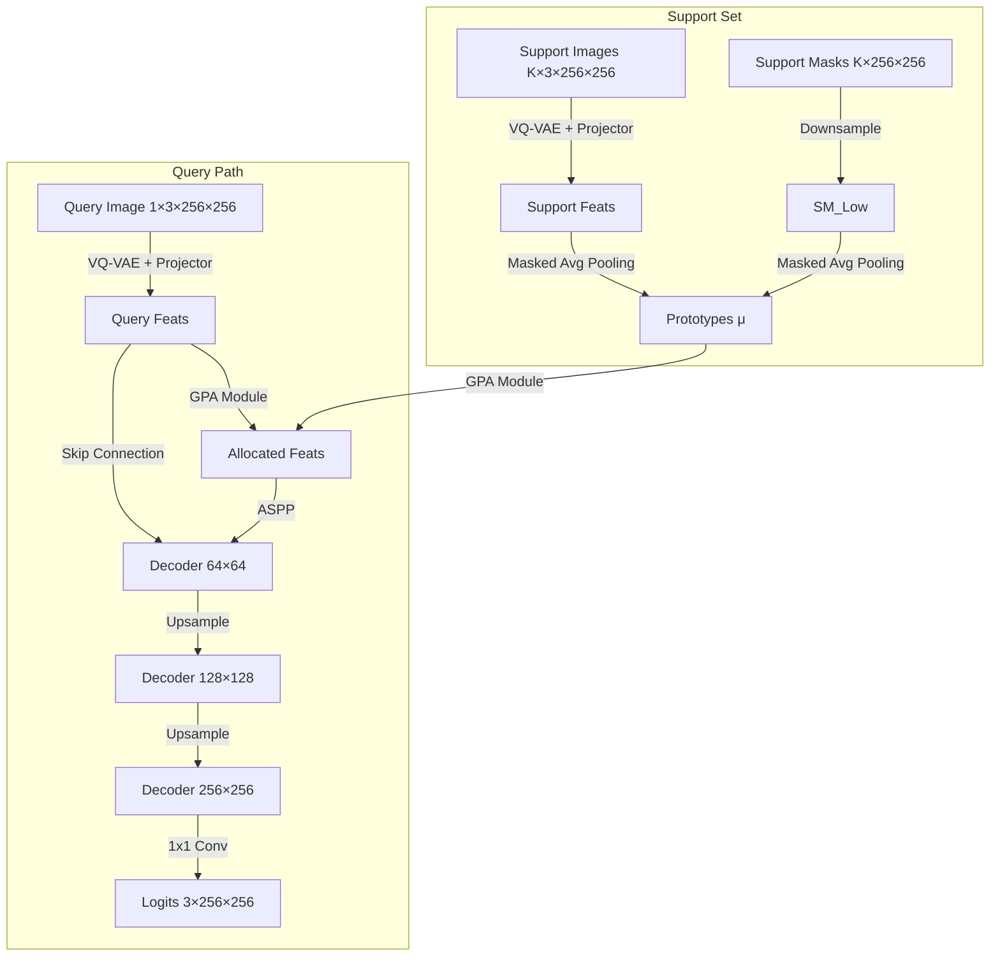

# Project-2: Few-Shot Segmentation on TIGER Dataset

**Technical Documentation & Architecture Overview**

## 1. Project Overview

This project implements a **3-Way Few-Shot Segmentation (FSS)** model for histopathology images (TIGER dataset). The goal is to segment **Tumor**, **Stroma**, and **Other** tissue types given only a few labeled support examples (shots), without retraining the backbone.

**Key Distinction:** Unlike standard FSS which treats 'background' as a discard class, we treat all 3 classes as targets of interest (no background class).

## 1.1 Project Directory Structure

```text
project2_fsl/
├── configs/                # Configuration files (YAML)
│   └── default.yaml        # Key hyperparameters (N-way, K-shot, LR, etc.)
├── data/                   # Data loading & processing
│   ├── tiger_dataset.py    # WSI patching, class balancing, normalization
│   ├── episodic_sampler.py # 3-class episode generation (mixed-support)
│   └── augmentations.py    # Albumentations pipeline
├── models/                 # Neural Network Components
│   ├── backbone.py         # Frozen VQ-VAE + Learnable Projector
│   ├── prototype.py        # Masked Average Pooling (MAP)
│   ├── gpa.py              # Guided Prototype Allocation (Attention)
│   ├── decoder.py          # Progressive DeepLabV3+ (Learned Upsample)
│   ├── segmentor.py        # Main model class (orchestrator)
│   ├── losses.py           # Combined Loss (CE + Dice + Focal)
│   └── attention.py        # Attention Gates for Skip Connections
├── engine/                 # Training Loops
│   ├── trainer.py          # Training epoch logic
│   └── evaluator.py        # Validation/Testing logic
├── utils/                  # Utilities
│   ├── metrics.py          # Per-class IoU, Dice, SoftDice
│   ├── visualization.py    # Overlay generation (Tumor=Red, Stroma=Green)
│   └── checkpointing.py    # Model saving/loading
├── train.py                # Main entry point for training
└── search_hyperparams.py   # Optuna HPO script
```

---

## 2. Methodology & Architecture

The model follows a **Prototypical Network** approach with **Guided Prototype Allocation (GPA)** and a **Progressive DeepLabV3+** decoder.

### 2.1. Feature Backbone (VQ-VAE)

Instead of a standard ResNet, we use a **frozen VQ-VAE encoder** pretrained on histopathology patches.

* **Input:** $256 \times 256$ RGB Image.
* **Encoder:** Frozen VQ-VAE (downsampling factor 4).
* **Output:** $256 \text{ channels} \times 64 \times 64$.
* **Adaptation:** A learnable **Residual Feature Projector** (2 blocks of Conv + GroupNorm + ReLU) adapts the frozen frozen features for the segmentation task. This is the only trainable part of the encoder.

### 2.2. Prototype Extraction

Prototypes are class-representative feature vectors computed from the Support Set.

* We use **Masked Average Pooling (MAP)** over the support images.
* For each class $c \in \{\text{Tumor, Stroma, Other}\}$:
    $$ \mu_c = \frac{\sum_{i=1}^{K} \sum_{x,y} F_i(x,y) \cdot \mathbb{1}[M_i(x,y) = c]}{\sum_{i=1}^{K} \sum_{x,y} \mathbb{1}[M_i(x,y) = c] + \epsilon} $$
    Where $F_i$ are support features and $M_i$ are support masks.
* **Multi-Scale Prototypes:** We compute prototypes not just globally ($1 \times 1$), but also on spatial grids (e.g., $2 \times 2$ or $4 \times 4$) to capture intra-class spatial variance.

### 2.3. Guided Prototype Allocation (GPA)

Instead of simple cosine similarity, we use **GPA** (from ASGNet) to align query features with prototypes.

1. **Correlation:** Compute similarity between every query pixel $q$ and every prototype $p$.
    $$ E_{q,p} = \frac{q \cdot p}{\|q\| \|p\|} \cdot \frac{1}{\tau} $$
2. **Soft Allocation:** Compute attention weights via Softmax.
    $$ \alpha_{q,p} = \text{softmax}(E_{q,p}) $$
3. **Reconstruction:** Construct a "prototype-aligned" feature map for the query.
    $$ H_q = \sum_{p} \alpha_{q,p} \cdot p $$
This $H_q$ represents "what the query looks like in prototype space".

### 2.4. Progressive DeepLabV3+ Decoder

We replaced the standard bilinear upsampler with a learned progressive decoder to recover fine details.

* **Input:** Concatenation of GPA Output ($H_q$) and Skip Features from backbone.
* **Stage 0 ($64 \times 64$):** ASPP (Atrous Spatial Pyramid Pooling) to capture multi-scale context.
* **Stage 1 ($128 \times 128$):** Transposed Convolution (Upsample) $\to$ Refinement Convs.
* **Stage 2 ($256 \times 256$):** Transposed Convolution (Upsample) $\to$ Refinement Convs.
* **Output:** $3 \times 256 \times 256$ Logits.
* **Initialization:** Weights initialized with Kaiming Normal (Fan Out) for stable training.

---

## 3. Few-Shot Episodic Training Strategy

Training mimics the test-time few-shot scenario (Episodic Learning).

### 3.1. Episode Construction

Each iteration (episode) consists of:

* **$N$-Way:** 3 (Tumor, Stroma, Other).
* **$K$-Shot:** e.g., 5 support patches.
* **Query:** 1 query patch.

### 3.2. Mixed-Support Sampling

Since histopathology patches are dense and heterogeneous, we cannot assume patches contain only one class.

* **Strategy:** We use a **Greedy Class Coverage** sampler.
* It selects $K$ support patches such that their union covers all 3 classes as evenly as possible.
* The Query patch is constrained to contain at least 2 classes to ensure a challenging segmentation task.

### 3.3. Patient Disjointness

To ensure generalizability:

* **Constraint:** Support patches and Query patch must come from **different WSIs (Whole Slide Images)**.
* This forces the model to learn invariant tissue features rather than memorizing patient-specific color/texture histograms.

---

## 4. Mathematical Optimization

### 4.1. Loss Function

We optimize a combined loss function $L$:
$$ L = \lambda_{ce} L_{CE} + \lambda_{dice} L_{Dice} + \lambda_{focal} L_{Focal} $$

#### A. Cross-Entropy ($L_{CE}$)

Standard pixel-wise classification loss.

#### B. Soft Dice Loss ($L_{Dice}$)

Maximizes overlap between prediction and ground truth, robust to class imbalance.
$$ L_{Dice} = 1 - \frac{2 \sum p_i g_i}{\sum p_i + \sum g_i + \epsilon} $$

#### C. Focal Loss ($L_{Focal}$)

Focuses on hard-to-classify examples.
$$ FL(p_t) = -\alpha_t (1 - p_t)^\gamma \log(p_t) $$

* We use **Per-Class Weights** $\alpha_t = [\alpha_{tumor}, \alpha_{stroma}, \alpha_{other}]$ to explicitly balance rare classes (e.g., Stroma).

### 4.2. Optimization

* **Optimizer:** AdamW.
* **Learning Rate:** One Cycle Cosine Annealing.
* **Backbone:** Frozen (Gradient stop).
* **Trained Components:** Projector, GPA, Decoder, Prototype (Temperature only).

---

## 5. Summary of Data Flow


